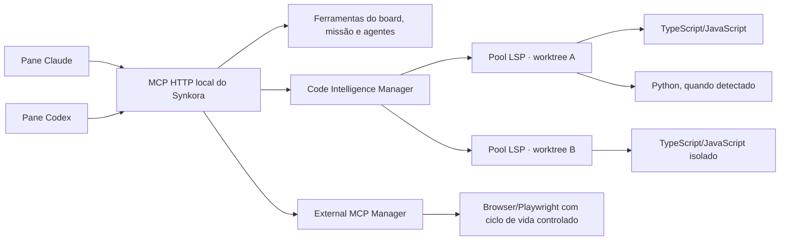

# Synkora — plano de performance, MCP 2026 e inteligência por LSP

> Documento de continuidade criado em 2026-07-31. Ele deve sobreviver a um `/clear` e
> servir como briefing completo para a próxima execução.

## Como retomar em uma conversa nova

Enviar ao agente:

> Leia `docs/PLANO_MCP_LSP.md` por inteiro, confira o estado atual do repositório e
> execute o plano em fases. Preserve todas as alterações existentes. Comece pela
> instrumentação e pelos benchmarks; não ative o MCP moderno globalmente e não crie
> um LSP por pane.

Antes de editar, o agente também deve ler `CLAUDE.md` e `docs/HANDOFF.md`, verificar
`git status` e tratar qualquer alteração já existente como trabalho do usuário.

## Resultado pretendido

O objetivo não é apenas atualizar uma dependência. O Synkora deve:

1. abrir panes com ferramentas externas mais rapidamente e sem tempestade de processos;
2. dar a Claude e Codex a mesma inteligência estrutural sobre o código;
3. manter um servidor de linguagem aquecido por worktree, sem misturar branches;
4. suportar MCP 2026-07-28 quando o cliente aceitar, sem quebrar clientes antigos;
5. medir o ganho real de cada mudança, com possibilidade de desligar e reverter;
6. preservar integralmente TUI, comandos slash, formatos, permissões, panes e fluxo atual.

O novo MCP não é, sozinho, a principal otimização. Os maiores ganhos devem vir de:

- remover `npx ...@latest` do caminho de abertura do pane;
- evitar processos equivalentes iniciados repetidamente;
- consultar definições, referências e diagnósticos via LSP em vez de procurar arquivos
  e texto repetidamente;
- reduzir contexto enviado aos modelos usando respostas estruturadas e compactas.

## Diagnóstico confirmado em 2026-07-31

### Estado do MCP no Synkora

- `package.json` usa `@modelcontextprotocol/sdk` `^1.29.0`.
- `src/main/mcpServer.ts` usa `McpServer` e `StreamableHTTPServerTransport` do SDK v1.
- O transporte local já é stateless no modelo antigo:
  `sessionIdGenerator: undefined`.
- Cada requisição autenticada cria um servidor/transport e registra as ferramentas.
- Há 25 ferramentas registradas em ordem determinística.
- O servidor fica em HTTP local, ligado a `127.0.0.1`, com bearer token por pane.
- Claude e Codex recebem o mesmo hub Synkora, mas com configurações próprias de cliente.
- Panes estritos também recebem MCPs de Playwright.

### Compatibilidade observada

| Componente | Estado observado | Decisão |
|---|---|---|
| SDK MCP TypeScript | v2 final disponível | Pode migrar o servidor |
| Codex CLI 0.146.0 | contém `mcp_2026_07_28`, experimental e desligado | Opt-in detectado, nunca forçar |
| Claude Code 2.1.220 | instalação atual não anuncia MCP 2026-07-28 | Continuar no protocolo legado |
| Synkora | servidor v1 stateless | Migrar para servidor dual-era |

Conclusão: o Synkora pode adotar MCP 2026 agora, mas deve servir o protocolo moderno e
o legado simultaneamente. Tornar o protocolo moderno obrigatório quebraria a instalação
atual do Claude Code.

### Baseline medido

Medições locais feitas contra o servidor Synkora ativo, sem registrar ou expor tokens:

| Medição | Resultado |
|---|---:|
| `initialize`, mediana de 20 rodadas quentes | 2,52 ms |
| `tools/list`, mediana de 20 rodadas quentes | 3,26 ms |
| `tools/list`, tamanho aproximado | 13.968 bytes |
| 32 panes simulados, `initialize + tools/list` | 220,12 ms totais |
| `npx -y @playwright/mcp@latest --version`, quente | ~1,26 s |
| `npx playwright --version`, no repositório | ~2,75 s |

Interpretação:

- eliminar o handshake MCP atual economiza milissegundos, não segundos;
- o processo externo iniciado via `npx` é aproximadamente duas ordens de grandeza mais
  caro que o handshake local;
- várias inicializações concorrentes pioram CPU, disco e memória mesmo quando parte da
  espera acontece em paralelo;
- a primeira prioridade de performance deve ser o caminho dos MCPs externos.

### Baseline de LSP

O projeto já depende de TypeScript `^7.0.2` como dependência de desenvolvimento. O
TypeScript 7 instalado possui servidor LSP nativo por stdio.

Medição local sobre o próprio Synkora:

| Operação | Resultado observado |
|---|---:|
| Inicialização do servidor | 6,16 ms |
| Símbolos de documento | 35,91 ms |
| Referências | 2,58 ms |
| Definição | 15,97 ms |
| Diagnósticos pull | 28,94 ms |

São tempos do protocolo local, não do turno completo do modelo. Ainda assim, demonstram
que um servidor aquecido pode substituir várias buscas e leituras por uma consulta curta.

## Ganho esperado, sem promessas artificiais

### O que deve melhorar muito

- abertura de panes que hoje disparam MCPs externos via `npx`;
- estabilidade ao abrir vários panes ao mesmo tempo;
- navegação em bases grandes e desconhecidas;
- precisão ao encontrar definições, referências, tipos e implementações;
- diagnóstico antes de review e QA;
- consumo de contexto em tarefas dominadas por exploração de código;
- uso de CPU e memória quando diversos panes trabalham na mesma worktree.

### O que deve melhorar pouco

- tempo de geração de texto do Claude/Codex;
- latência de rede e fila do provedor;
- panes de conversa que não exploram código;
- tarefas pequenas que já sabem exatamente qual arquivo editar.

### Metas iniciais a validar por A/B

Estas são metas de engenharia, não resultados garantidos:

- reduzir em pelo menos 50% o tempo de preparação das ferramentas externas nos panes
  afetados;
- manter consultas LSP quentes abaixo de 100 ms no p95 para TypeScript/JavaScript;
- reduzir de 10% a 30% o tempo de missões dominadas por navegação em código;
- reduzir de 15% a 40% o contexto gasto com procura/leitura nessas mesmas missões;
- manter no máximo um servidor por combinação `worktree + linguagem + configuração`;
- não introduzir qualquer regressão em comandos, TUI, resize, scroll ou permissões.

Os percentuais de missão e contexto só serão aceitos depois de comparação repetível em
missões reais. Se o benchmark não confirmar o ganho, o documento deve ser atualizado com
os números efetivos.

## Decisões arquiteturais já tomadas

1. **MCP 2026 será dual-era.** Moderno quando suportado, legado como fallback.
2. **O recurso experimental do Codex não será ativado globalmente.** Haverá detecção e
   opção controlada, inicialmente desligada ou em modo automático seguro.
3. **Não haverá um LSP por pane.** Isso recriaria a tempestade de processos que estamos
   tentando eliminar.
4. **O pool de LSP será separado por worktree.** Compartilhar entre branches produziria
   referências e diagnósticos incorretos.
5. **Claude e Codex receberão a mesma camada de inteligência.** A interface comum será o
   MCP do Synkora; o suporte LSP nativo do Claude pode ser estudado depois como complemento.
6. **Nenhum `@latest` será resolvido durante a abertura normal do pane.** Versões devem
   ser fixadas, empacotadas ou resolvidas localmente de forma determinística.
7. **Playwright não será removido.** A capacidade de browser deve permanecer; só será
   alterada a forma de inicialização.
8. **Toda otimização será mensurada e protegida por fallback.** Não trocar arquitetura
   por sensação subjetiva de velocidade.

## Arquitetura de destino



O `PaneIdentity` existente já contém `cwd`, projeto, papel e pane. Ele deve ser a fonte
da worktree autorizada para o broker de código e para ferramentas externas.

## Plano de implementação

### Fase 0 — instrumentação e benchmark reproduzível

Objetivo: obter números antes de alterar o comportamento.

Implementar:

- marcos monotônicos para:
  - pedido de criação do pane;
  - início e conclusão do spawn do PTY;
  - MCP interno disponível;
  - MCPs externos disponíveis;
  - primeiro frame do terminal;
  - primeira mensagem enviada;
  - primeiro output do agente;
- logs de performance sem prompt, resposta, token de autenticação ou chave de API;
- scripts reproduzíveis, preferencialmente:
  - `scripts/bench-mcp.mjs`;
  - `scripts/bench-lsp.mjs`;
  - `scripts/bench-pane-startup.mjs`;
- cenários de 1, 8 e 32 panes;
- comparação de pane livre, maestro/orquestrador e pane estrito de execução.

Saída da fase:

- baseline salvo com data, versão de Claude, versão de Codex e versão do Synkora;
- nenhuma mudança funcional perceptível;
- métricas suficientes para provar ou rejeitar as fases seguintes.

### Fase 1 — retirar `npx @latest` do caminho crítico

Objetivo: eliminar o maior custo medido sem perder ferramentas.

Passos:

1. Fixar uma versão compatível de `@playwright/mcp` no Synkora e empacotá-la como
   dependência de runtime, ou resolver seu entrypoint diretamente nos recursos do app.
2. Executar o entrypoint com o Node/Electron apropriado, sem consulta ao registry.
3. Para `playwright run-test-mcp-server`, preferir a versão instalada no projeto da
   worktree. Não baixar Playwright silenciosamente quando o projeto não o possui.
4. Manter o mesmo conjunto de ferramentas e o mesmo isolamento observado hoje.
5. Repetir benchmarks após apenas essa troca.

Se o custo de spawn continuar alto:

- criar um gateway HTTP local controlado pelo Synkora;
- manter worker aquecido ou pool pré-aquecido;
- isolar browser context por pane/projeto;
- validar explicitamente se o servidor suporta múltiplos clientes sem vazamento de
  estado antes de compartilhar um processo;
- se o compartilhamento não for seguro, usar pool de processos prontos em vez de um
  processo global.

Não construir o gateway antes de medir a versão fixada: a solução mais simples deve
prevalecer se já eliminar o gargalo.

Critérios de aceite:

- nenhuma execução normal usa `npx -y ...@latest`;
- nenhum download acontece ao abrir pane;
- browser e Playwright Test continuam disponíveis onde já estavam;
- tempo de preparação cai pelo menos 50% no ambiente de referência, ou fica documentado
  por que o limite é externo ao Synkora.

### Fase 2 — Code Intelligence Manager e LSP TypeScript/JavaScript

Objetivo: entregar inteligência estrutural comum para Claude e Codex.

Estrutura sugerida, ajustável à arquitetura encontrada na implementação:

```text
src/main/codeIntelligence/
  manager.ts       ciclo de vida, pool e limites
  lspClient.ts     JSON-RPC/LSP por stdio
  servers.ts       detecção e comandos por linguagem
  documents.ts     didOpen/didChange/didClose e versões
  types.ts         respostas internas compactas
```

Responsabilidades:

- chave do pool: caminho canônico da worktree + tipo/versão/configuração do servidor;
- detectar raiz por `cwd`, `package.json`, `tsconfig.json`, `jsconfig.json` e marcadores
  equivalentes;
- abrir documentos sob demanda e sincronizar alterações feitas pelos agentes;
- observar mudanças no disco sem enviar tempestades de eventos;
- reiniciar servidor morto com backoff e limite de tentativas;
- expirar servidores ociosos e impor teto de processos/memória;
- invalidar estado quando worktree for removida;
- nunca permitir caminhos fora da worktree autorizada do pane.

TypeScript/JavaScript:

- usar o LSP nativo do TypeScript 7 quando o projeto for compatível;
- garantir que o binário esteja presente no app empacotado — hoje TypeScript é somente
  `devDependency` e não pode ser presumido em produção;
- para projetos que exigem TypeScript 6 ou integrações específicas, usar o servidor e a
  versão do próprio projeto;
- Vue, Svelte, Astro e Angular exigem fallback próprio antes de prometer cobertura de
  templates e arquivos embutidos.

Ferramentas MCP iniciais:

- `code_diagnostics`;
- `code_definition`;
- `code_references`;
- `code_symbols`;
- `code_hover`;
- `code_implementations`;
- `code_call_hierarchy`.

Formato das ferramentas:

- receber caminhos relativos à worktree;
- expor linha/coluna em base 1 para os agentes e converter internamente para LSP;
- ordenar resultados deterministicamente;
- devolver caminhos relativos, intervalos curtos e mensagens compactas;
- limitar resultados e indicar `truncated: true` quando necessário;
- nunca despejar centenas de referências no contexto sem paginação/limite;
- incluir linguagem, servidor utilizado e estado de atualização quando relevante.

Não incluir inicialmente:

- autocomplete;
- semantic tokens;
- formatação automática;
- edição automática por LSP;
- rename aplicado diretamente.

Depois do MVP, `rename_preview` pode devolver um workspace edit para revisão. A aplicação
real deve continuar pelo mecanismo normal de patch do agente.

Integração com os agentes:

- acrescentar às personas a orientação de usar LSP antes de buscas amplas;
- exigir `code_diagnostics` antes de `report(done)` em tarefas de código quando houver
  servidor compatível;
- permitir fallback transparente para pesquisa textual quando não houver LSP;
- não instalar o plugin LSP nativo do Claude em todos os panes na primeira fase, pois
  isso pode duplicar os processos compartilhados pelo Synkora.

Critérios de aceite:

- dois panes na mesma worktree reutilizam o mesmo servidor;
- duas worktrees do mesmo projeto usam servidores isolados;
- referências nunca apontam para a branch errada;
- encerramento de um pane não mata servidor ainda usado por outro;
- processo ocioso é encerrado conforme política;
- Claude e Codex recebem respostas equivalentes;
- p95 quente abaixo de 100 ms no projeto de referência;
- pane continua funcional quando o LSP falha ou não existe.

### Fase 3 — outras linguagens

Adicionar somente quando houver projeto real para validar:

1. Python — Pyright;
2. Rust — rust-analyzer;
3. Go — gopls;
4. servidores específicos de frameworks web;
5. outras linguagens conforme uso comprovado.

Para cada servidor:

- detectar binário local antes de baixar qualquer coisa;
- deixar instalação explícita na configuração quando necessário;
- registrar versão e capacidades;
- adaptar diagnósticos e navegação ao mesmo contrato MCP;
- adicionar fixture/projeto real ao benchmark.

### Fase 4 — migração para MCP 2026-07-28 em modo dual

Objetivo: preparar o Synkora para a revisão final do protocolo sem quebrar os clientes.

Passos:

1. Migrar do pacote monolítico v1 para os pacotes v2 adequados de servidor/core/node.
2. Usar o handler HTTP dual-era recomendado pelo SDK.
3. Preservar autenticação bearer por pane e resolução de `PaneIdentity`.
4. Preservar as 25 ferramentas existentes, adicionando as de inteligência de código.
5. Servir clientes legados com `initialize`, `initialized` e `tools/list`.
6. Servir clientes modernos com `server/discover` e capacidades por requisição.
7. Definir `ttlMs` e `cacheScope` coerentes para catálogos estáveis.
8. Manter ordem determinística de ferramentas e schemas para aproveitar cache.
9. Detectar suporte do Codex antes de injetar `mcp_2026_07_28`.
10. Manter Claude no fallback até a instalação realmente anunciar a revisão nova.

Modo de configuração recomendado:

```text
mcpProtocolMode: auto | legacy | modern-experimental
```

- `auto`: padrão; moderno apenas quando detectado com segurança;
- `legacy`: recuperação e diagnóstico;
- `modern-experimental`: opt-in explícito, inicialmente útil para Codex compatível.

Testes obrigatórios:

- cliente legado: inicialização, lista e chamada de ferramenta;
- cliente moderno: descoberta e chamada;
- dois clientes de eras diferentes simultaneamente;
- autenticação inválida e token de outro pane;
- 32 clientes concorrentes;
- cancelamento e desconexão;
- identidade/cwd corretos em todas as ferramentas;
- nenhuma regressão em Claude, Codex, maestro, orquestrador, dev, review, QA, ajudante e
  agente livre.

Critérios de aceite:

- protocolos antigo e novo funcionam no mesmo build;
- o modo `auto` nunca impede a abertura de um pane;
- ganho de tempo é reportado honestamente, mesmo que seja de poucos milissegundos;
- rollback para `legacy` não exige downgrade do aplicativo.

### Fase 5 — configuração e observabilidade

Adicionar à área de Configurações, preservando o padrão visual do app:

- **Inteligência de código:** Automática / Desligada;
- linguagens detectadas e estado do servidor;
- caminho/versão do servidor escolhido;
- MCP moderno: Automático / Legado / Experimental;
- estado dos serviços externos aquecidos;
- ação para reiniciar apenas o serviço problemático;
- métricas resumidas de preparação do pane, sem transformar a tela em painel técnico.

Padrão recomendado para usuário comum:

- Inteligência de código: Automática;
- MCP: Automático;
- serviços externos: Aquecimento automático;
- detalhes técnicos recolhidos.

## Validação final

Executar a mesma matriz antes e depois:

| Cenário | Quantidade |
|---|---:|
| Pane livre sem MCP externo | 1 e 8 |
| Maestro/orquestrador | 1 e 4 |
| Pane dev estrito com browser | 1, 8 e 32 |
| Panes na mesma worktree | 2, 4 e 8 |
| Panes em worktrees diferentes | 2, 4 e 8 |
| Consulta LSP quente/fria | pelo menos 30 rodadas |
| Reinício/crash do LSP | pelo menos 5 ciclos |

Missões A/B sugeridas:

1. localizar todas as referências de uma função e explicar impacto de mudança;
2. encontrar a origem de um diagnóstico TypeScript em vários arquivos;
3. preparar renomeação sem editar;
4. implementar ajuste pequeno e validar diagnósticos;
5. tarefa equivalente com LSP ligado e desligado.

Registrar:

- tempo até pane utilizável;
- tempo até ferramentas disponíveis;
- tempo até primeiro output;
- duração total da missão;
- número de ferramentas chamadas;
- tokens de entrada/cache quando o cliente fornecer a informação;
- processos e memória máximos;
- erros, restarts e fallbacks;
- resultado correto/incorreto, não apenas velocidade.

## Invariantes que não podem quebrar

- Todos os comandos slash do Claude e do Codex continuam funcionando.
- Perguntas, respostas, ANSI, resize, scroll e histórico do terminal não mudam.
- Panes permanecem TUI reais; o plano não substitui o terminal por chat renderizado.
- Bypass/permissões e strict MCP mantêm a política atual de cada papel.
- Browser continua disponível nos panes que já o recebem.
- Seats e diretórios de configuração continuam isolados.
- Tokens MCP nunca entram em log ou métrica.
- Um pane só consulta arquivos dentro da própria worktree.
- Falha de LSP/MCP externo degrada para o comportamento atual; nunca mata o pane.
- Nenhuma atualização de cliente é presumida: capacidades são detectadas em runtime.

## Riscos e mitigação

| Risco | Mitigação |
|---|---|
| MCP 2026 experimental mudar no Codex | detecção, flag e fallback legado |
| Claude não suportar a revisão nova | servidor dual-era |
| LSP consumir muita memória | pool, teto global, TTL e métricas |
| resultado da branch errada | chave obrigatória por worktree canônica |
| arquivo alterado fora do conhecimento do LSP | watcher + sincronização de documento |
| framework não entendido pelo TS LSP | servidor específico ou fallback textual |
| browser compartilhado vazar estado | contextos isolados ou pool, após teste explícito |
| dependência ausente no app empacotado | runtime dependency/resources e teste do `dist` |
| otimização piorar startup | A/B, feature flag e rollback |
| excesso de dados LSP gastar contexto | respostas compactas, ordenadas e limitadas |

## Ordem obrigatória

1. Fase 0 — medir.
2. Fase 1 — eliminar `npx @latest` e repetir a medição.
3. Fase 2 — LSP TypeScript compartilhado e validar isolamento.
4. Fase 3 — adicionar linguagens conforme necessidade real.
5. Fase 4 — MCP v2 dual-era.
6. Fase 5 — controles e observabilidade na Configuração.

Não começar pela migração do MCP apenas porque é a novidade mais visível. A medição já
mostrou que o handshake atual não é o maior gargalo.

## Estado do repositório ao criar este documento

O worktree já continha várias alterações do usuário. Em particular, na verificação de
2026-07-31:

- `package.json` estava modificado;
- `src/main/index.ts` estava modificado;
- `src/main/mcpServer.ts` aparecia como arquivo não rastreado, apesar de fazer parte da
  implementação atual;
- documentos existentes também estavam modificados.

Esses arquivos devem ser tratados como código real do usuário. Não executar reset,
checkout destrutivo ou substituição integral. Comparar e editar apenas os trechos
necessários.

## Referências oficiais

- MCP 2026-07-28: <https://modelcontextprotocol.io/specification/2026-07-28>
- Changelog da revisão: <https://modelcontextprotocol.io/specification/2026-07-28/changelog>
- Versionamento e eras: <https://modelcontextprotocol.io/specification/2026-07-28/basic/versioning>
- SDK TypeScript v2: <https://github.com/modelcontextprotocol/typescript-sdk/releases/tag/%40modelcontextprotocol%2Fserver%402.0.0>
- Migração v1 para v2: <https://github.com/modelcontextprotocol/typescript-sdk/blob/main/docs/migration/upgrade-to-v2.md>
- Suporte a MCP 2026 no SDK: <https://github.com/modelcontextprotocol/typescript-sdk/blob/main/docs/migration/support-2026-07-28.md>
- Modo MCP moderno do Codex: <https://github.com/openai/codex/blob/main/codex-rs/rmcp-client/src/protocol_mode.rs>
- LSP: <https://microsoft.github.io/language-server-protocol/>
- LSP em plugins do Claude Code: <https://code.claude.com/docs/en/plugins-reference>
- TypeScript 7 nativo: <https://devblogs.microsoft.com/typescript/announcing-typescript-7-0/>

## Definição de pronto

Este trabalho só termina quando:

- os benchmarks antes/depois estiverem registrados;
- panes não fizerem download nem resolverem `@latest` ao abrir;
- TypeScript LSP estiver compartilhado por worktree e acessível por Claude e Codex;
- diagnósticos/referências forem corretos em duas branches simultâneas;
- MCP moderno e legado passarem juntos;
- o modo automático nunca quebrar um cliente sem suporte;
- o app empacotado for testado, não apenas `npm run dev`;
- typecheck e build passarem;
- panes, comandos e TUI atuais continuarem visual e funcionalmente iguais;
- os ganhos reais substituírem as estimativas deste documento.
